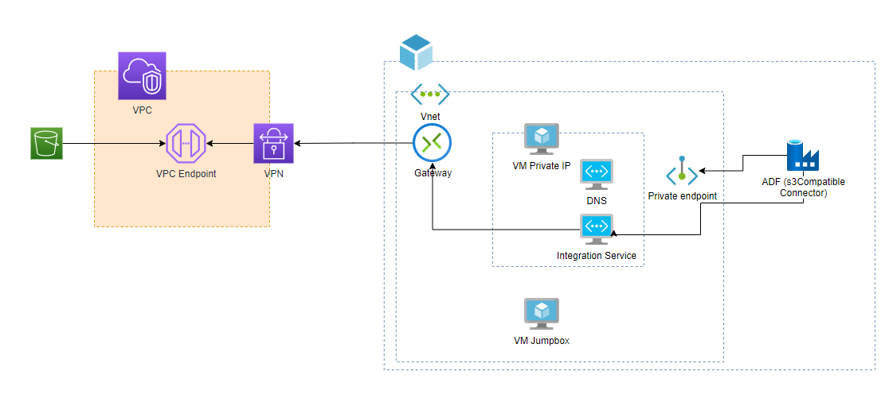

# AWS S3(VPCE) integration with Azure Data Factory
## Scenario: 
Organization has their data on AWS S3 Bucket and wants to move data to Azure via secure connection with VPN. 
## Issue:
ADF connector “S3 Connector” works correctly connecting directly to AWS S3 Bucket, but when S3 applies policies to close communication to the VPC network it fails.

[]

## Lab building:
- AWS S3: Created bucket for testing without any policy.
- AWS VPC - Azure Vnet: Lab requires an AWS Virtual Private Cloud and setup a Site-to-Site VPN to Azure Gateway. An step by step guide can be followed in this link:  [VPC-VPN-VNET Link](https://techcommunity.microsoft.com/t5/fasttrack-for-azure/how-to-create-a-vpn-between-azure-and-aws-using-only-managed/ba-p/2281900 "VPC-VPN-VNET Link")
- ADF environment: Create a VM for ADF Integration Runtime inside of the VNet. In my Lab I closed all public communication for IR and created communication with ADF.
 
- S3 policy: This policy blocks all communication except the VPC Communications. Policy:


```json
    {
        "Version": "2012-10-17",
        "Id": "VpcSourceIp",
        "Statement": [
            {
                "Sid": "VpcSourceIp",
                "Effect": "Deny",
                "Principal": "*",
                "Action": "s3:*",
                "Resource": [
                    "arn:aws:s3:::demoax",
                    "arn:aws:s3:::demoax/*"
                ],
                "Condition": {
                    "StringNotEquals": {
                        "aws:SourceVpc": "vpc-04724cb7fabc866a6"
                    }
                }
            }
       ]
    }
    
```
## Workaround:
Work around to make this work is based on these parts:
1. Configure DNS with a couple of CNAMES: This step makes the magic it helps ADF/IR resolve the correct IP. In the process of connect to S3 the connector uses *.s3.amazonaws.com and also *.s3.<s3 region>.amazonaws.com. 
   Both registers will be redirected with a CNAME to our VPCE from AWS. 
With this point the connector can resolve communication thru VPN to AWS.

2. Use Amazon S3 Compatible directly to your S3 bucket and use service url https://s3.BUCKET-REGION.amazonaws.com without bucket name.

3. Other part is to configure your bucket and folder(s). In this case I am getting all files in folder “demo1” on my bucket “demoax”.

Note : You won’t have a successful connection test or browse your folder. The reason is that you don’t have a bucket set up. If you want to test your connection, just add the bucket name in service.DO NOT FORGET TO REMOVE your bucket name. 

###### Some useful links:
When to use an AWS S3 VPC endpoint – Tom Gregory
How to eliminate Azure Data Factory's public Internet exposure using Private Link - Microsoft Industry Blogs - United Kingdom


[1]: https://techcommunity.microsoft.com/t5/fasttrack-for-azure/how-to-create-a-vpn-between-azure-and-aws-using-only-managed/ba-p/2281900 "VPC-VPN-VNET Link"
